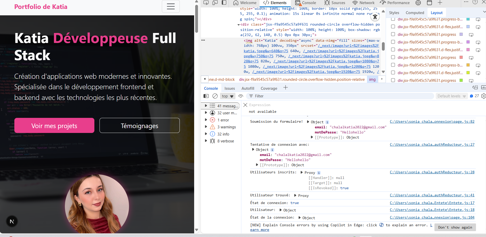

# Katia's Portfolio 

This project aims to create a **personal portfolio** using the **Next.js** framework. It serves as proof of skills for job hunting or any other purpose. This portfolio includes interactive pages with **login** and **inscription** forms based on **Redux**, as well as pages to display and add testimonials.
 
This is a [Next.js](https://nextjs.org) project bootstrapped with [`create-next-app`](https://nextjs.org/docs/app/api-reference/cli/create-next-app).

---

## 🔥 Project Features

This portfolio provides an interactive experience and includes the following features:

1. **Dynamic Home Page**  
   - Displays general information about the portfolio with links to different sections of the site.

2. **Secure Registration and Login**  
   - Uses **Redux** for managing user registration and login states.  
   - The registration form allows users to create an account and log in through the login form.  
   - Authentication management to protect certain pages (pages are accessible only after login).

3. **Testimonial Management**  
   - Users can add testimonials through a dedicated form.  
   - Testimonials are displayed in the **Testimonials** section of the site.  
   - **Redux** is used to manage adding, retrieving, and displaying testimonials.

4. **Page Protection**  
   - Certain pages of the site are protected and only accessible to authenticated users.  
   - **Next.js** is used to manage redirection and secure access to sensitive pages.

5. **Projects Section**  
   - Displays previous projects, allowing users to explore professional achievements.  
   

6. **My Services Section**  
   - A section dedicated to describing the services offered, providing an overview of professional skills and offerings.

7. **Reviews Section**  
   - Users can read reviews left by others about the services provided, with the option to leave feedback.

8. **About Section**  
   - Detailed information about the portfolio's creator and their professional skills, offering a deeper understanding of the individual behind the project.

9. **Responsive Design**  
   - The site is fully responsive and adapts automatically to different screen sizes (mobile, tablet, desktop).

10. **State Management with Redux**  
   - Redux is used for centralized application state management, especially for authentication, testimonial management, and project handling.

---

## Project Objective

This portfolio was designed to:

- Showcase my skills in web development.
- Learn how to use **Next.js** to build modern and performant applications.
- Implement **Redux** for state management (login, registration, testimonials).
- Create a responsive site that adapts to different devices (mobile, tablet, desktop).
- Manage page protection (only pages accessible after login are visible).

---

##  Technologies Used

This project uses the following technologies:

- **Next.js**: Framework for server-side and client-side rendering with React.
- **React.js**: JavaScript library for building user interfaces.
- **Redux**: Used for state management (login, registration, testimonials).
- **CSS**: For layout and design styling.

- ---------------
## Site Preview

### Console



### Home Page


### Registration Page


### Login Page


### Testimonial 1


### Testimonial 2


### Project 1


### Project 2


### Projects Section


### Reviews


### My Services


### About


---

## 🚀 Installation and Running the Project Locally

### Prerequisites:

Make sure you have **Node.js** and **npm** installed on your machine before proceeding.

## Getting Started

First, run the development server:

```bash
npm run dev
# or
yarn dev
# or
pnpm dev
# or
bun dev
```

Open [http://localhost:3000](http://localhost:3000) with your browser to see the result.

You can start editing the page by modifying `app/page.js`. The page auto-updates as you edit the file.

This project uses [`next/font`](https://nextjs.org/docs/app/building-your-application/optimizing/fonts) to automatically optimize and load [Geist](https://vercel.com/font), a new font family for Vercel.

## Learn More

To learn more about Next.js, take a look at the following resources:

- [Next.js Documentation](https://nextjs.org/docs) - learn about Next.js features and API.
- [Learn Next.js](https://nextjs.org/learn) - an interactive Next.js tutorial.

You can check out [the Next.js GitHub repository](https://github.com/vercel/next.js) - your feedback and contributions are welcome!

## Deploy on Vercel

The easiest way to deploy your Next.js app is to use the [Vercel Platform](https://vercel.com/new?utm_medium=default-template&filter=next.js&utm_source=create-next-app&utm_campaign=create-next-app-readme) from the creators of Next.js.

Check out our [Next.js deployment documentation](https://nextjs.org/docs/app/building-your-application/deploying) for more details.
